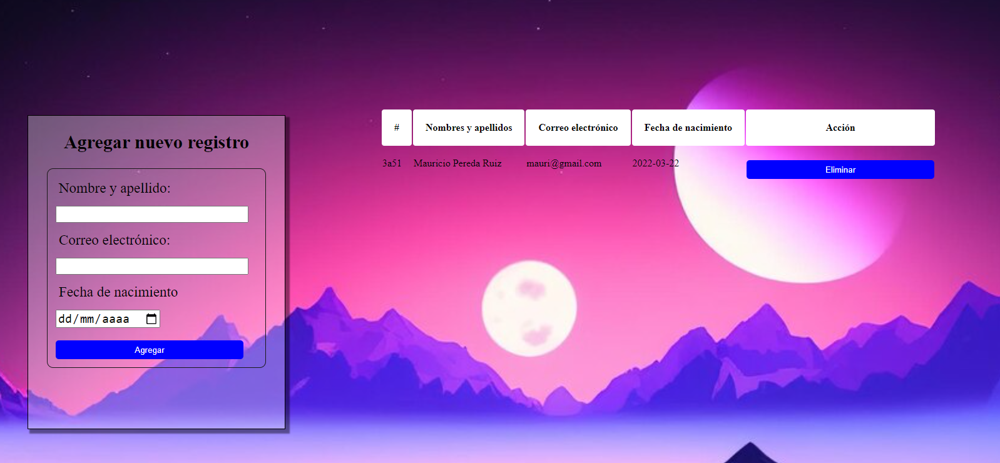

# Sistema de Registro de Usuarios con Vite y JSON Server

## Maquetacion del registro de usuarios

Este codigo HTML define un sistema de registro que facilita a los usuarios agregar nuevos registros con información detallada como nombre,apellido,correo electrónico y fecha de nacimiento. La interfaz incluye un formulario interactivo con campos diseñados para capturar datos precisos los cuales son mostrados dinámicamente en una tabla dentro de la misma página. Un script JavaScript complementario gestiona la lógica de la aplicación, permitiendo la interacción fluida y la comunicación eficiente con un servidor JSON para almacenar y recuperar los datos de los usuarios.

```HTML
<!doctype html>
<html lang="en">
  <head>
    <meta charset="UTF-8" />
    <link rel="icon" type="image/svg+xml" href="/vite.svg" />
    <meta name="viewport" content="width=device-width, initial-scale=1.0" />
    <title>Vite App</title>

  </head>
  <body>
    <form class="formulario">
      <h2>Agregar nuevo registro</h2>
      <article class="borde">
        <div>
          <label>Nombre y apellido: </label>
          <input type="text" id="nombre">
        </div>
        
        <div>
          <label>Correo electrónico: </label>
          <input type="email" id="correo">
        </div>

        <div>
          <label>Fecha de nacimiento</label>
          <input type="date" id="fechaNacimiento">
        </div>

        <div>
          <button type="submit">Agregar</button>
        </div>
      </article>
    </form>

    <article class="items">
      <table id="tabla-users">
        <thead>
          <tr>
            <th scope="col">#</th>
            <th scope="col">Nombres y apellidos</th>
            <th scope="col">Correo electrónico</th>
            <th scope="col">Fecha de nacimiento</th>
            <th scope="col">Acción</th>
          </tr>
        </thead>
        <tbody>
          <!-- Aquí se añadirán dinámicamente los usuarios -->
        </tbody>
      </table>
    </article>

    <script type="module" src="/main.js"></script>
  </body>
</html>
```


## Funcionamiento del registro de usuarios 

En mi JavaScript facilita la interaccion entre una aplicación web y un servidor JSON (http://localhost:3000/users) permitiendo cargar,agregar y eliminar usuarios dinámicamente desde una tabla HTML (#tabla-users). Utiliza eventos y peticiones para mantener actualizada la interfaz con los datos del servidor asegurando una experiencia interactiva y fluida para gestionar registros de usuarios.

1. Carga de Usuarios Iniciales:

    - Al cargar la página (DOMContentLoaded), se invoca la función cargarUsuarios(), la cual realiza una solicitud Fetch al servidor JSON para obtener la lista actual de usuarios.

    - Los datos recibidos se insertan dinámicamente en la tabla HTML (#tabla-users), donde cada usuario se representa como una fila (<tr>) con detalles como ID, nombre, correo electrónico, y fecha de nacimiento. Cada fila incluye también un botón de eliminación para interactuar con los usuarios.

2. Agregar Nuevo Usuario:

    - Cuando el usuario completa y envía el formulario (form.submit), se capturan los valores de nombre (#nombre), correo electrónico (#correo), y fecha de nacimiento (#fechaNacimiento).

    - Se valida que todos los campos estén completos. Si algún campo falta, se muestra un mensaje de error en la consola del navegador.

    - Si todos los campos están completos, se crea un objeto nuevoUsuario con los datos ingresados.

    - Se realiza una solicitud Fetch con método POST al servidor JSON para agregar el nuevo usuario. Una vez agregado con éxito, se vuelve a cargar la lista de usuarios (cargarUsuarios()) para reflejar el cambio en la tabla.

3. Eliminar Usuario:

    - Se utiliza un evento delegado en la tabla de usuarios (tablaUsuarios) para detectar clics en botones de eliminación (click).

    - Al hacer clic en un botón de eliminar, se obtiene el ID único del usuario a través del atributo data-id.

    - Se realiza una solicitud Fetch con método DELETE al servidor JSON para eliminar el usuario correspondiente por su ID.

    - Si la eliminación es exitosa (respuesta 200 OK), se elimina visualmente la fila de la tabla sin necesidad de recargar toda la página.



## Authors

- [@Mauricio Pereda Ruiz](https://github.com/MauriPereda05)

